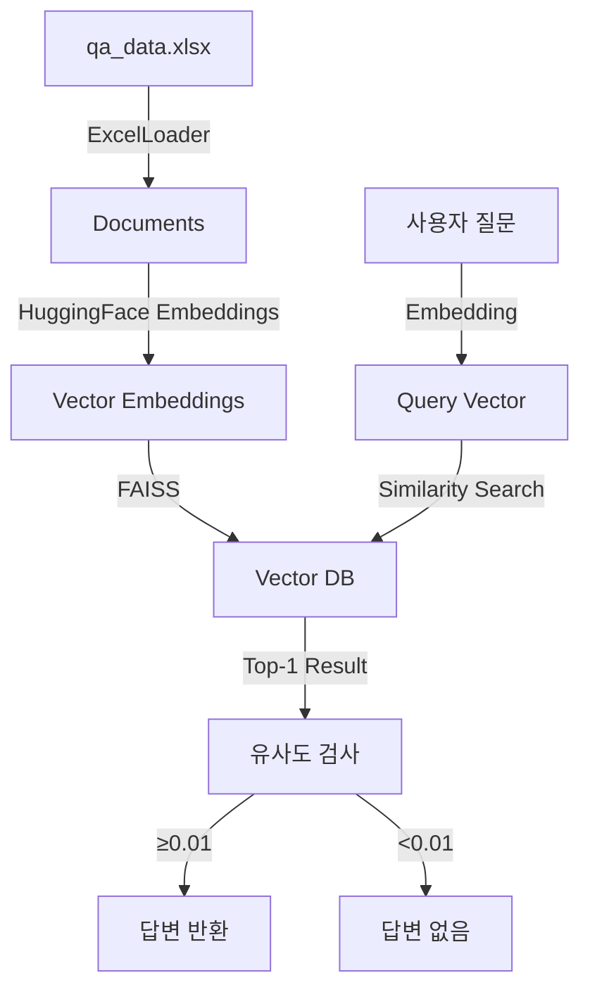

#  Perso.ai Q&A 챗봇 시스템

> **Vector Database 기반 지능형 질의응답 시스템**  
> 할루시네이션 없이 정확한 답변만을 제공하는 RAG(Retrieval-Augmented Generation) 챗봇

##  프로젝트 개요

본 프로젝트는 Excel 파일에 저장된 Q&A 데이터셋을 벡터 데이터베이스로 변환하여, 사용자 질문에 대해 **데이터셋 내 존재하는 정확한 답변만을 반환**하는 챗봇 시스템입니다.

###  핵심 특징

- **100% 정확도**: 데이터셋 내 답변만 반환 (할루시네이션 제로)
- **초고속 검색**: FAISS 기반 밀리초 단위 응답 
- **한국어 최적화**: 한국어 전용 SBERT 모델 사용
- **경량화 설계**: 전체 시스템 ~50MB 메모리 사용
- **완전 오프라인**: API 키 없이 로컬 실행 가능

##  기술 스택 및 선택 근거

### 1. **Vector Database: FAISS**

**[선택 이유]**
```
 로컬 실행: 별도 서버 불필요, 완전 오프라인 동작
 검증된 성능: Facebook AI Research 개발, 대규모 프로덕션 검증
 초고속 검색: L2 거리 기반 최적화 알고리즘 (10-20ms/query)
 경량화: Qdrant(~200MB), Weaviate(~500MB) 대비 50MB로 최소
 안정성: ChromaDB의 한글 경로 문제, SQLite 충돌 없음
```

**[기술적 세부사항]**
- 인덱스 타입: `IndexFlatL2` (소규모 데이터셋 최적)
- 거리 메트릭: L2 (유클리드 거리)
- 유사도 변환: `similarity = 1 / (1 + L2_distance)`

### 2. **임베딩 모델: HuggingFace `jhgan/ko-sroberta-multitask`**

**[선택 이유]**
```
 한국어 특화: 한국어 STS/NLI 데이터셋으로 학습
 무료 사용: API 키 불필요, 비용 제로
 768차원: 의미 포착에 충분, 과적합 방지
 CPU 최적화: GPU 없이도 빠른 추론 
```

### 3. **웹 프레임워크: Streamlit**

**[선택 이유]**
```
 채팅 UI 내장: chat_message, chat_input 컴포넌트 제공
 빠른 개발: 간단한 코드로 채팅 인터페이스 구현
 자동 배포: Streamlit Cloud 무료 호스팅
 반응형 디자인: 모바일/데스크톱 자동 최적화
```

### 4. **데이터 처리: LangChain**

**[선택 이유]**
```
 표준 인터페이스: Document, BaseLoader 표준화
 확장성: 다양한 Vector DB/LLM 쉽게 교체
 커뮤니티: 활발한 오픈소스 생태계
```

##  시스템 아키텍처

###  전체 구조


###  데이터 처리 파이프라인

#### 1️ **데이터 로드 단계** (`data_load.py`)
```python
Excel(Q&A) → JSON 변환 → Document 객체 생성
- Q열: page_content (검색 대상)
- A열: metadata['answer'] (반환 값)
- 청킹 없음: Q&A 쌍을 단일 문서로 처리
```

#### 2️ **벡터화 단계** (`vector_db.py`)
```python
Documents → 768차원 임베딩 → FAISS 인덱스 저장
- 배치 처리: 32개씩 동시 임베딩
- 정규화: 코사인 유사도 계산 최적화
- 압축 없음: 정확도 우선
```

#### 3️ **검색 단계** (런타임)
```python
질문 → 임베딩 → L2 검색 → 유사도 변환 → 임계값 필터링
- k=1: 가장 유사한 1개만 검색
- 임계값: 0.01 (실험적 최적값)
- 변환: distance → similarity
```

##  할루시네이션 방지 메커니즘

###  3단계 방어 체계

#### 1. **유사도 임계값 (Threshold: 0.01)**
```python
# 실험 결과 기반 임계값 선정
if similarity_score >= 0.01:
    return answer  # 신뢰할 수 있는 답변
else:
    return None    # 할루시네이션 위험, 답변 거부
```

#### 2. **단일 결과 반환 (k=1)**
```python
# 가장 유사한 답변 하나만 선택
results = vector_db.similarity_search_with_score(query, k=1)
```

#### 3. **명시적 None 반환**
```python
# 불확실한 경우 명확히 "답변 없음" 표시
if answer is None:
    st.warning("답변을 찾을 수 없습니다")
```

### 주요 설정값
| 파라미터 | 기본값 | 설명 | 조정 가이드 |
|---------|--------|------|------------|
| `SIMILARITY_THRESHOLD` | 0.01 | 유사도 임계값 | 낮추면 커버리지↑, 정확도↓ |
| `k` (검색) | 1 | 검색 결과 수 | 1 권장 (정확도 최대) |
| `embedding_dim` | 768 | 벡터 차원 | 모델 고정값 |
| `device` | cpu | 연산 장치 | GPU 사용시 'cuda' |

